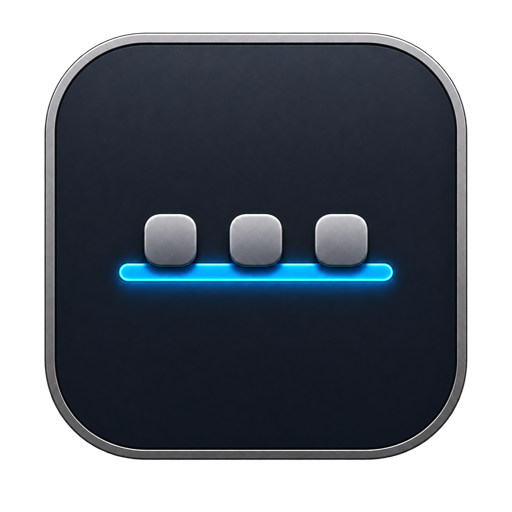

# StatusPerch

**Language:** English · [简体中文](README.zh-Hans.md)

> English is the default language for this repository and its documentation entry page. StatusPerch itself can follow the macOS language or be switched explicitly between English and Simplified Chinese.

  

<strong>A quieter menu bar for macOS.</strong>

  Local · Lightweight · Permission-free · English & 简体中文

  <a href="https://github.com/qingtan-labs/StatusPerch/releases/latest"><strong>Download the latest release</strong></a>
  ·
  <a href="docs/user-manual/en/README.md">English manual</a>
  ·
  <a href="docs/user-manual/zh-Hans/README.md">简体中文手册</a>

StatusPerch is a compact native macOS utility that places a movable boundary in the menu bar. Put low-frequency status items to the left of the boundary, then hide or reveal them with one click.

## Download

| Version | System | Architecture | Installer |
| --- | --- | --- | --- |
| 1.0.0 | macOS 13 Ventura or later | Apple silicon + Intel (Universal 2) | [StatusPerch-1.0.0-Universal.dmg](https://github.com/qingtan-labs/StatusPerch/releases/download/v1.0.0/StatusPerch-1.0.0-Universal.dmg) |

SHA-256: `b93c55b9448085652b14affcdbb6daa3fb643f82d4d5961f4609b1bede7cb19e`

The checksum is also provided as a separate `SHA256SUMS` file on the [Releases page](https://github.com/qingtan-labs/StatusPerch/releases).

> **Current signing status:** 1.0.0 is ad-hoc signed but not Apple-notarized. For the first launch, Control-click StatusPerch in Applications and choose **Open**. Never disable Gatekeeper. See the [safe installation guide](docs/user-manual/en/1-installation.md).

## Highlights

- Hide and reveal low-frequency menu-bar items with one click.
- Reorder StatusPerch and other compatible status items using Command-drag.
- Automatically hide after 5, 10, or 30 seconds.
- Launch at login with a compatibility fallback for the current build.
- Follow the system language or choose English / Simplified Chinese.
- Follow Light or Dark appearance automatically.
- Run entirely offline without analytics, accounts, Screen Recording, or Accessibility permission.
- Native Universal 2 build for Apple silicon and Intel Macs.

## Quick start

1. Download and open the DMG.
2. Drag StatusPerch into Applications.
3. Control-click StatusPerch and choose **Open** on the first launch.
4. Hold Command and drag the chevron and boundary to the desired positions.
5. Move items you want to collect to the left of the boundary.
6. Click the chevron to hide or reveal the collected area.

Right-click the chevron to configure auto-hide, Launch at Login, language, help, or quit.

StatusPerch uses the ordering behavior provided by macOS. Some Apple system items and third-party apps may not support Command-drag. macOS does not provide a general public API for displaying arbitrary third-party status items in a true second row; StatusPerch therefore focuses on reliable native hiding rather than simulating one.

## Documentation

- [User manual language index](docs/user-manual/README.md)
- [English user manual](docs/user-manual/en/README.md)
- [简体中文用户手册](docs/user-manual/zh-Hans/README.md)
- [Privacy](PRIVACY.md)
- [Security policy](SECURITY.md)
- [Support](SUPPORT.md)
- [Changelog](CHANGELOG.md)
- [1.0.0 release notes](docs/release-notes/v1.0.0.md)

## Privacy

StatusPerch does not require an account, does not contain analytics, and does not transmit user data. Its core menu-bar organization works without Screen Recording or Accessibility access. Read the full [privacy statement](PRIVACY.md).

## About this repository

This public repository contains user documentation, release notes, brand artwork, checksums, and downloadable binary releases. It intentionally does **not** contain application source code. The official installers are available only from this repository's Releases page.

## License

The StatusPerch application and brand assets are proprietary freeware. You may download and use the official unmodified application at no charge under the terms in [LICENSE.md](LICENSE.md). Third-party notices are bundled inside the application.

---

## 中文简介

StatusPerch 是一款轻量、原生、完全本地运行的 macOS 菜单栏收纳工具。将低频图标放到边界左侧，即可通过箭头一键收起或展开。

- [下载最新版](https://github.com/qingtan-labs/StatusPerch/releases/latest)
- [简体中文用户手册](docs/user-manual/zh-Hans/README.md)
- [安全安装说明](docs/user-manual/zh-Hans/1-installation.md)
- [隐私说明](PRIVACY.md#简体中文)

1.0.0 尚未经过 Apple 公证，首次运行请在“应用程序”中按住 Control 点击 StatusPerch，然后选择“打开”；不要关闭 Gatekeeper。
