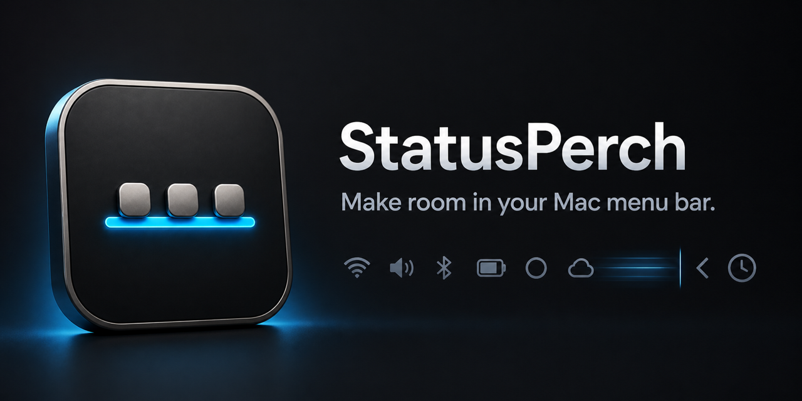

# StatusPerch

**语言：** [English](README.md) · 简体中文

> 仓库与文档入口默认显示英文，可通过顶部语言入口切换为简体中文。StatusPerch 应用界面支持“跟随系统、English、简体中文”三种模式。

  

<strong>让 macOS 菜单栏更安静。</strong>

  完全本地 · 轻量原生 · 无需隐私权限 · English &amp; 简体中文

  <a href="https://qingtan-labs.github.io/StatusPerch/"><strong>产品主页</strong></a>
  ·
  <a href="https://github.com/qingtan-labs/StatusPerch/releases/latest"><strong>下载最新版</strong></a>
  ·
  <a href="docs/user-manual/zh-Hans/README.md">中文用户手册</a>
  ·
  <a href="docs/user-manual/en/README.md">English Manual</a>

StatusPerch 是一款轻量、原生的 macOS 菜单栏收纳工具。它在菜单栏中放置一个可移动边界：将低频图标移动到边界左侧，即可通过箭头一键收起或展开。

## 下载

| 版本 | 系统要求 | 架构 | 安装包 |
| --- | --- | --- | --- |
| 1.0.0 | macOS 13 Ventura 或更高版本 | Apple 芯片 + Intel（Universal 2） | [StatusPerch-1.0.0-Universal.dmg](https://github.com/qingtan-labs/StatusPerch/releases/download/v1.0.0/StatusPerch-1.0.0-Universal.dmg) |

SHA-256：`b93c55b9448085652b14affcdbb6daa3fb643f82d4d5961f4609b1bede7cb19e`

也可从 [Releases 页面](https://github.com/qingtan-labs/StatusPerch/releases)下载独立的 `SHA256SUMS` 校验文件。

> **当前签名状态：** 1.0.0 使用临时签名，尚未经过 Apple 公证。首次运行时，请在“应用程序”中按住 Control 点击 StatusPerch，然后选择“打开”。不要关闭 Gatekeeper。详见[安全安装指南](docs/user-manual/zh-Hans/1-installation.md)。

## 主要功能

- 一键收起与展开低频菜单栏图标。
- 按住 Command 拖动 StatusPerch 和其他兼容的状态栏图标进行排列。
- 支持展开后 5、10、30 秒自动收起。
- 支持登录时自动启动，并为当前版本提供兼容方案。
- 支持跟随系统、English、简体中文。
- 自动适配 macOS 亮色与暗色主题。
- 完全离线运行，不包含统计，不需要账号、屏幕录制或辅助功能权限。
- Universal 2 原生支持 Apple 芯片和 Intel Mac。

## 快速上手

1. 下载并打开 DMG。
2. 将 StatusPerch 拖入“应用程序”。
3. 首次运行时，按住 Control 点击 StatusPerch，然后选择“打开”。
4. 按住 Command，将小竖线和箭头拖到合适位置。
5. 将需要收纳的低频图标移动到小竖线左侧。
6. 单击箭头收起或展开收纳区。

右键箭头可设置自动收起、登录启动、语言、帮助或退出。

StatusPerch 使用 macOS 提供的原生状态栏排列机制。部分 Apple 系统图标或第三方应用可能不支持 Command 拖动。macOS 没有提供将任意第三方状态栏图标展示为真正第二行的通用公开接口，因此 StatusPerch 采用更可靠的原生隐藏方式，不模拟双行菜单栏。

## 文档

- [用户手册语言入口](docs/user-manual/README.md)
- [简体中文用户手册](docs/user-manual/zh-Hans/README.md)
- [English User Manual](docs/user-manual/en/README.md)
- [隐私说明](PRIVACY.md#简体中文)
- [安全政策](SECURITY.md)
- [支持说明](SUPPORT.md)
- [更新记录](CHANGELOG.md)
- [1.0.0 发布说明](docs/release-notes/v1.0.0.md)

## 隐私

StatusPerch 不需要账号，不包含统计，也不会传输用户数据。菜单栏收纳核心功能无需“屏幕录制”或“辅助功能”权限。详见[隐私说明](PRIVACY.md#简体中文)。

## 关于本仓库

本公共仓库仅包含用户文档、发布说明、品牌物料、校验值和可下载的二进制 Release，**不包含应用源码**。官方安装包仅通过本仓库的 Releases 页面提供。

## 许可

StatusPerch 应用和品牌素材属于专有免费软件。你可以根据 [LICENSE.md](LICENSE.md) 免费下载和使用官方未修改版本。第三方许可说明已包含在应用程序中。
